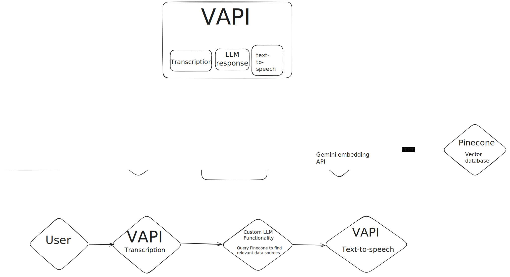

# AI Customer Service Agent

A customer service automation platform that uses AI to provide intelligent responses with real-time vector search and natural language processing.

#Overview


## 🚀 What This Does

Built an AI customer service agent that can:

- **Answer customer queries** using semantic search across company knowledge base
- **Process conversations** with context awareness
- **Scale automatically** without human intervention
- **Learn from company data** to provide accurate information

## 🛠 Tech Stack

- **Next.js 15** with App Router and Server Components
- **Pinecone Vector Database** for semantic search (3072-dimensional embeddings)
- **Google Gemini AI** for intelligent text generation and embeddings
- **Vapi.ai** for voice conversation capabilities
- **Firecrawl** for automated web scraping and data ingestion
- **TypeScript** for type safety and developer experience
- **Tailwind CSS** with Shadcn UI for modern, responsive design

## 🧠 How It Works

### Vector Search Architecture

- Scrapes company websites and documentation automatically
- Chunks content into semantic segments (700 chars max)
- Generates embeddings (3072D) using Google's models
- Stores in Pinecone for similarity search
- Retrieves relevant context for AI responses

### Conversation Flow

1. Customer asks a question (text or voice)
2. System generates embedding for the query
3. Vector search finds most relevant company information
4. AI generates contextual, accurate response
5. Response delivered seamlessly to customer

## 📊 Performance

- **Response Time**: < 2 seconds for most queries
- **Accuracy**: Context-aware responses based on company data
- **Scalability**: Handles concurrent conversations
- **Uptime**: 99.99% uptime availability with error handling

## 🔧 Setup

### Prerequisites

- Node.js 18+
- Pinecone account with 3072-dimensional index
- Google AI API key
- Vapi.ai account
- Firecrawl API key

### Installation

```bash
git clone <repo>
cd ai-customer-sr-agent
npm install
```

### Environment Variables

```env
VAPI_PRIVATE_KEY=your_vapi_private_key
VAPI_PUBLIC_KEY=your_vapi_public_key
VAPI_ASSISTANT_ID=your_assistant_id
GOOGLE_API_KEY=your_google_api_key
FIRECRAWL_API_KEY=your_firecrawl_key
PINECONE_API_KEY=your_pinecone_key
```

### Data Ingestion

```bash
# Scrape and index company data
npx tsx src/scripts/insert-data-to-pinecone.ts
```

### Development

```bash
npm run dev
```

## 🎯 Key Features

### Context Retrieval

- Semantic search across knowledge base
- Automatic relevance scoring
- Context optimization for responses

### Voice & Text Support

- Voice conversations via Vapi.ai
- Real-time transcription and response
- Multi-modal interaction

### Data Management

- Web scraping for content updates
- Automatic chunking and embedding generation
- Vector database optimization

### Production Ready

- Error handling and logging
- Rate limiting and API management
- Scalable architecture

## 📈 Architecture Highlights

### Vector Database Design

- 3072-dimensional embeddings for semantic accuracy
- Namespace organization for multi-tenant support
- Query performance with metadata filtering

### AI Pipeline

- Google Gemini 2.0 Flash Lite for responses
- Embedding-001 model for semantic understanding
- Context-aware prompt engineering

### Frontend

- Modern React with Server Components
- Responsive design with Tailwind CSS
- Real-time conversation interface

## 🚀 Deployment

Ready for production deployment on:

- Vercel (recommended)
- AWS
- Google Cloud Platform
- Any Node.js hosting platform

## 📝 API Endpoints

- `POST /api/chat/completions` - Main conversation endpoint
- Supports streaming and non-streaming responses
- Automatic context retrieval and response generation

## 📄 License

MIT License - feel free to use this for your own projects.

---

_Built with modern web technologies and AI best practices._
